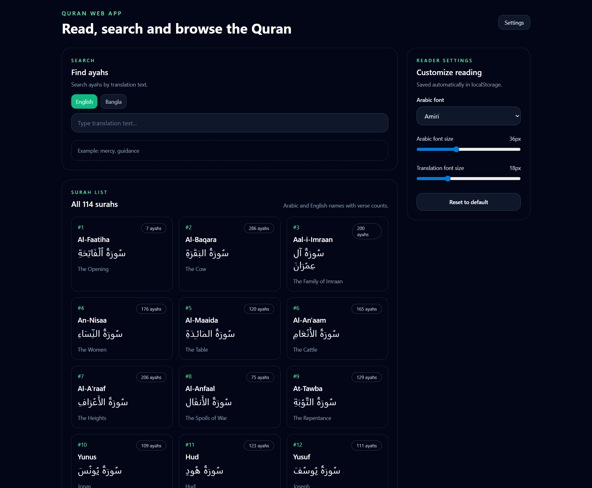
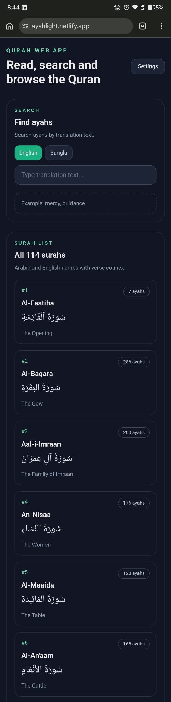
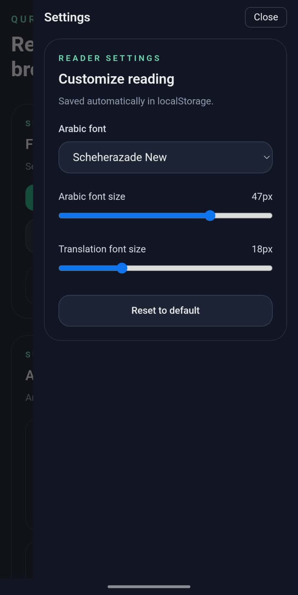

# Quran Web Application

A responsive Quran web app built with **Next.js**, **Tailwind CSS**, and the public **quran-json** dataset.


### 🗂 Application Page


<div style="display: flex; gap: 20px;">

  <div style="flex: 1; text-align: center;">
    <h3>Mobile View</h3>
    
  </div>

  <div style="flex: 1; text-align: center;">
    <h3>Responsive Setting</h3>
    
  </div>

</div>

## Features

- Responsive UI
- Surah list page showing all 114 surahs with Arabic and English names
- Ayat page for each surah with Arabic text and English translation
- Search ayahs by translation text
- Settings sidebar with:
  - Arabic font selection (Amiri / Noto Naskh Arabic, Scheherazade New)
  - Arabic font size control
  - Translation font size control
  

## Tech Stack

- Frontend: Next.js 14
- Backend/runtime: Node.js
- Styling: Tailwind CSS
- Data source: quran-json dataset over jsDelivr CDN

## Run locally

```bash
npm install
npm run dev
```

## Production

```bash
npm install
npm run build
npm run start
```

## Live Link

https://ayahlight.netlify.app/

## Explanation Video:
 https://drive.google.com/file/d/1xVWNgD_RXF9nfr0D61Hc71IZy7BgnUFr/view?usp=sharing


